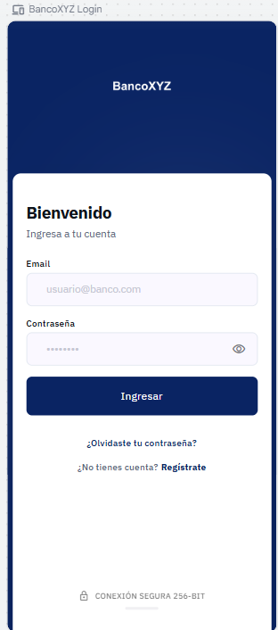

# BancoXYZ

App bancaria desarrollada en React que permite autenticarse, visualizar el saldo de cuenta, realizar transferencias bancarias y consultar el historial de movimientos con filtros.

---

## Capturas — versión móvil

<table>
  <tr>
    <td align="center">
      
      <br /><sub><b>Login</b></sub>
    </td>
    <td align="center">
      
      <br /><sub><b>Dashboard</b></sub>
    </td>
    <td align="center">
      
      <br /><sub><b>Nueva Transferencia</b></sub>
    </td>
    <td align="center">
      
      <br /><sub><b>Historial</b></sub>
    </td>
  </tr>
</table>

---

## Tecnologías

| Categoría | Librería |
|---|---|
| UI | React 19, Material UI v5 |
| Routing | React Router v6 |
| Estado global | Zustand |
| Data fetching | TanStack Query v5 |
| HTTP | Axios (Singleton con interceptores) |
| Tests | Jest + React Testing Library |
| Build | Create React App + CRACO |

---

## Requisitos previos

- Node.js >= 18
- npm >= 9

---

## Instalación

```bash
git clone <url-del-repositorio>
cd bancoxyz
npm install
```

---

## Variables de entorno

Copia `.env.example` y crea tu archivo de entorno local:

```bash
cp .env.example .env.development
```

| Variable | Descripción |
|---|---|
| `REACT_APP_LOGIN_URL` | Endpoint de autenticación (POST /login) |
| `REACT_APP_BALANCE_URL` | Endpoint de saldo (GET /balance) |
| `REACT_APP_TRANSFER_URL` | Endpoint de transferencia (POST /transfer) |
| `REACT_APP_TRANSFER_LIST_URL` | Endpoint de historial (GET /transferList) |

---

## Ejecutar en desarrollo

```bash
npm start
```

Abre [http://localhost:3000](http://localhost:3000) en el navegador.

**Credenciales de prueba:**

| Email | Contraseña |
|---|---|
| gabriel@topaz.com | 1111 |
| alejo@topaz.com | 2222 |
| wilson@topaz.com | 3333 |

---

## Ejecutar tests

```bash
# Todos los tests (sin modo watch)
npm test -- --watchAll=false

# Suite específica
npm test -- --testPathPattern=LoginPage --watchAll=false
npm test -- --testPathPattern=BalanceCard --watchAll=false
npm test -- --testPathPattern=TransferForm --watchAll=false
npm test -- --testPathPattern=TransfersList --watchAll=false
```

**Suites incluidas:**

| Archivo | Qué cubre |
|---|---|
| `LoginPage.test.jsx` | Campos, validación email, error 401 |
| `BalanceCard.test.jsx` | Saldo, moneda, estado de carga |
| `TransferForm.test.jsx` | Validaciones de monto, documento, submit |
| `TransfersList.test.jsx` | Listado, filtro por nombre, estado vacío |
| `AuthGuard.test.jsx` | Redirección sin token, acceso con token |
| `Button.test.jsx` | Render, onClick, disabled, loading |
| `authStore.test.js` | login(), logout(), estado inicial |
| `validators.test.js` | Email, password, monto, fecha, documento |

---

## Build para producción

```bash
npm run build
```

La carpeta `build/` contiene el bundle optimizado listo para deploy.

---

## Estructura del proyecto

```
src/
├── api/                   # Capa HTTP — un archivo por endpoint
│   ├── axiosClient.js     # Singleton Axios con interceptores de auth
│   ├── auth.api.js
│   ├── balance.api.js
│   ├── transfer.api.js
│   └── transferList.api.js
├── components/
│   ├── ui/                # Button, Input, Loader, ErrorMessage, BottomTabBar
│   ├── auth/              # AuthGuard
│   ├── balance/           # BalanceCard
│   ├── transfer/          # TransferForm
│   ├── transfers/         # TransferList, FiltersBar
│   └── layout/            # AppLayout, DesktopSidebar
├── hooks/                 # TanStack Query hooks
│   ├── useLoginMutation.js
│   ├── useBalanceQuery.js
│   ├── useTransferMutation.js
│   └── useTransfersQuery.js
├── pages/                 # Cada página tiene su hook de negocio
│   ├── LoginPage/
│   ├── DashboardPage/
│   ├── TransferPage/
│   └── TransfersListPage/
├── store/                 # Zustand — authStore, uiStore
├── utils/                 # validators, formatters, localTransfers
├── routes/                # AppRouter + AuthGuard
└── styles/                # tokens.css (design tokens)
```

---

## Funcionalidades

- **Login** — validación de email/contraseña, manejo de error 401
- **Saldo** — consulta en tiempo real con caché de 30 s
- **Transferencias** — monto, moneda, documento del destinatario, fecha (permite programar a futuro)
- **Historial** — agrupado por fecha, filtros por nombre, monto mín/máx y rango de fechas
- **Persistencia local** — las transferencias realizadas se guardan en `localStorage` y se muestran de inmediato en el historial aunque el API de listado no las registre
- **Diseño responsive** — mobile-first con barra de navegación inferior; layout de escritorio con sidebar fijo
